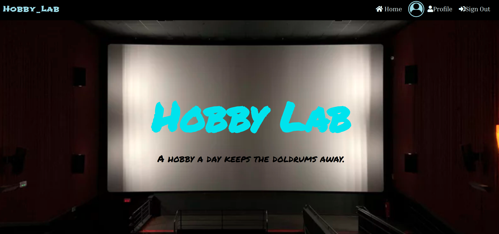

# [Hobby_Lab]()

This project was generated with [Django](https://www.djangoproject.com) version 2.2.8 <br>



To view the site Click [Hobby_Lab.com]()

## Author: 
  * [Peter Mirithu](https://github.com/petermirithu/hooby_lab)

#### Authors' information
*Peter Mirithu*
    Email: pyra_m.k@yahoo.com <br>
    Address: 1394 <br>
    Software Developer.<br>
    Telephone N.O: 0790476167          
## Description
  Hobby lab is the name for the  app. Its an app that connects people who share a hobby eg game and music. It spears the world to be a better living place for people.

## Specifications
  * Behaviours
  ```
  Displays the landing page                     ~ When the app loads on startup.

  Display sign in page                          ~ When the sign in button is clicked.

  Displays sign up page                         ~When the sign up is clicked.

  Displays profile page                         ~When one logs in automatically and when profile button is clicked.

  Displays a form to update profile             ~When one clicks the update profile button.

  Displays tik tak toe game menu.               ~When one clicks on tik tak toe button on home page.    

  Displays a chat room.                         ~When the join room button is clicked.

  Displays a user profile.                      ~when one clicks on a username.

  Displays music.                               ~when the music href is clicked.
          
  Logs out a user.                              ~when the sign out button is clicked
  ```

## Setup Requirements
  Here's a brief introduction on what a developer must do in order to start running the app locally:

  ```
  $ git clone (https://github.com/petermirithu/hooby_lab
  $ cd hooby_lab/
  ```
  * create a virtual environment
  * Activate the virtual environment
  * create your own database
  * add configurations for the database in the project settings file
  * Update .env file with you configurations.
  
  ```
  $ pip install -r requirements.txt
  $ chmod a+x start.sh
  $ ./start.sh
  ```
  <hr>
  To run tests:

  ```
  $ python3.6 manage.py test hooby_app
  ```
  <hr>
     
## Technologies Used
  This project was generated with:
  * [Python](https://www.python.org/) version 3.8.0. 
  * [Django](https://www.djangoproject.com/) version 2.2.8
  * Bootstrap4.  
  * CSS3
  * PSQL database.  
  * Upload Care.
  * Heroku.
  * Vue js.
  * Twilio.  

 ## Support and contact details
  Incase of a problem, issue or need more clarification, feel free to send an email<br> @ pyra_m.k@yahoo.com<br>
  Contact Pyra at : 0790476167

 ## License
  This project is licensed by [MIT License](LICENSE.txt)<br>
                Copyright (c) <br>
                [Peter Mirithu](https://github.com/petermirithu/Grant_py) <br>
                  2020<br>
  
  


